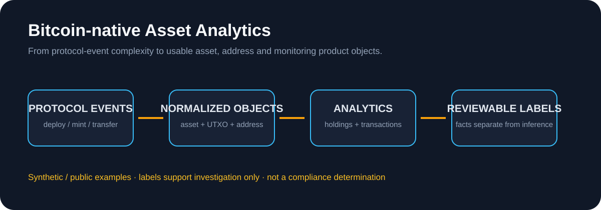

# Bitcoin-native Asset Analytics

A portfolio case study for normalizing and analyzing Bitcoin-native assets across Ordinals, BRC-20, and Runes.

**Role lens:** Product Management  
**Product area:** On-chain Data · UTXO · Address Analytics · Event Modeling · Risk Labels  
**Artifacts:** Data model · Event model · Risk-label boundaries · Product decisions · Metrics · Synthetic sample data  
**Portfolio:** [Valarie Yang — Product Portfolio](https://www.figma.com/design/pIUP2RYiUR3fpGoKHjRGnU/Valarie-Yang-%E2%80%94-Product-Portfolio?node-id=0-1)  


**Profile:** [LinkedIn](https://www.linkedin.com/in/valarie-yang-08573b122/) · [GitHub](https://github.com/valarie-yang)

> Public-safe portfolio reconstruction using synthetic / public examples. No confidential company data. No claim of Bitcoin protocol-core, indexer-engine, compliance, or exchange pricing infrastructure ownership.

## Case signal

This case is designed to show product thinking for on-chain data infrastructure: before charts can be trusted, events, assets, addresses, UTXOs, metadata, and inferred labels need a stable product model.

A reviewer should be able to see:

- How Bitcoin-native asset events can be normalized into product objects
- Why asset discovery and address behavior analysis serve different user jobs
- How factual chain data differs from inferred labels or monitoring categories
- How data freshness, missing records, and indexer delay become product states

## Founder Orange review pass

**Verdict:** strong flagship-supporting case for Web3 data, exchange asset-product, wallet analytics, and risk-monitoring roles.

**Sharpened positioning:** this repo proves that I can reason from protocol/event complexity toward usable analytics surfaces without overstating certainty or hiding data-quality limits.

## My role and scope

Represented PM work:

- Asset identification, holdings, and transaction tracking
- Product object and field definitions
- Deploy / Mint / Transfer event semantics
- Asset, address, and transaction analytics surfaces
- Risk labels, monitoring logic, and review boundaries
- Product decisions and proposed metrics

Implementation boundary:

- No ownership claim over Bitcoin protocol development, indexer-engine implementation, compliance determinations, exchange pricing infrastructure, or smart-contract engineering

## Core model

```text
Protocol event
   ↓
Normalize Deploy / Mint / Transfer
   ↓
Transaction
   ↓
UTXO + Address relationships
   ↓
Holding / Asset view
   ↓
Analytics + Monitoring
```

## Product decisions highlighted

1. **Normalize before visualizing** — protocol-specific events need a stable object and field model before dashboards can be trusted.
2. **Separate asset and address jobs** — asset discovery and address behavior analysis should connect without collapsing into one view.
3. **Separate fact from inference** — chain facts remain distinct from risk labels, monitoring categories, and suspicious-activity hypotheses.
4. **Make data quality visible** — missing, delayed, or inconsistent indexing states should be treated as product states, not hidden implementation details.
5. **Avoid false certainty** — labels support investigation; they are not compliance determinations.

## Repository map

- [`docs/data-model.md`](docs/data-model.md) — core product objects
- [`docs/event-model.md`](docs/event-model.md) — Deploy / Mint / Transfer normalization
- [`docs/risk-labels.md`](docs/risk-labels.md) — monitoring labels and review boundaries
- [`docs/product-decisions.md`](docs/product-decisions.md) — key PM trade-offs
- [`docs/product-metrics.md`](docs/product-metrics.md) — proposed product metrics
- [`docs/portfolio-evidence-index.md`](docs/portfolio-evidence-index.md) — recruiter reading path and evidence status
- [`THIRD-PARTY-NOTICES.md`](THIRD-PARTY-NOTICES.md) — data provenance and privacy boundary
- [`data/sample_events.csv`](data/sample_events.csv) — synthetic event sample

## Portfolio connection

This repository supports on-chain data, wallet asset, Web3 analytics, risk-monitoring, and exchange asset-product roles. The visual case study is maintained separately in Figma.
